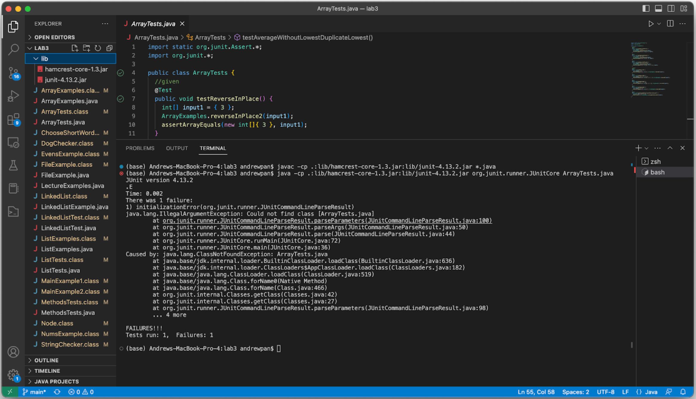

## Debugging Scenario
**Edstem Question**

**Code ScreenShot**

**Solution**
Hello, it seems like you have the commands typed correctly up until the string `ArrayTests.java`. You do not need the extension `.java` since the bashscript looks for the class name, not the file name. By typing `ArrayTests`, it should fix the issue.

**Solution ScreenShot**

As you can see, I typed ArrayTests without the extension and the bashscript ran fine. Remember that it should be the class name, not the file name. Thank you!

## Reflection
CSE 15L was an interesting class that taught me that I did not think I was going to learn or need. It was pretty cool how we were able to interact with the terminal and it was something that I had been wanting to learn because I was considering turning the Windows 10 PC into a linux machine. With this course, I am now comfortable enough to mess around with the terminal and have a good idea on how to access directories and execute them/open them. Sure, it taught me most of the basics, but once you learn the basics, you just keep digging and next thing you know, you are a pro! That being said, this lab has pushed me to idea of turning my PC into a linux system and experiment with computers more. Another area I would like to mention is learnign VIM. Now that was fun because I was terrified on what i was going to get into. I had seen many memes and how its hard and old, and I kind of agree, but it a cool experience and will try to solve a codwars challenge only using VIM.
